<p align="center">
  
</p>

<h1 align="center">codediag</h1>

<p align="center">
  <strong>Diagnose your code before you ship.</strong><br>
  <sub>One command. Five analyzers. One score.</sub>
</p>

<p align="center">
  <a href="https://www.npmjs.com/package/codediag"></a>
  <a href="https://www.npmjs.com/package/codediag"></a>
  <a href="https://github.com/scuton-technology/codediag/actions"></a>
  <a href="https://github.com/scuton-technology/codediag/blob/main/LICENSE"></a>
</p>

<br>

<p align="center">
  
</p>

<br>

## Install

```bash
npx codediag scan .
```

That's it. No config. No account. No server.

Or install globally:

```bash
npm install -g codediag
```

## What it checks

codediag auto-detects your stack and runs 5 analyzers:

### API Health `NestJS`

Discovers endpoints from `@Get`, `@Post`, `@Put`, `@Delete`, `@Patch` decorators using real AST analysis (ts-morph, not regex). Checks auth guards, typed DTOs, Swagger docs, and return types.

### Security

Scans for hardcoded secrets (API keys, Stripe keys, AWS credentials, GitHub tokens), validates `.gitignore`, checks helmet middleware, CORS configuration, rate limiting, and password hashing.

### Dependencies

Runs `npm audit`, checks lock file existence, flags deprecated packages, validates engine specs and essential npm scripts.

### Testing

Detects test files and frameworks (Jest, Vitest, Mocha, Ava), calculates test-to-source ratio, checks for e2e directories and coverage configuration.

### Structure

Validates README quality, linter/formatter config, TypeScript strict mode, NestJS module organization, and `.env.example` presence.

## Scoring

Each analyzer scores 0-100. Weighted average determines the grade:

```
API Health: 25%  ·  Security: 30%  ·  Dependencies: 20%  ·  Testing: 15%  ·  Structure: 10%
```

| A+ | A | B+ | B | C | D | F |
|:--:|:-:|:--:|:-:|:-:|:-:|:-:|
| 95+ | 90+ | 85+ | 80+ | 70+ | 60+ | <60 |

## CLI

```bash
codediag scan .                    # Full report
codediag scan . --format json      # JSON (for CI/CD)
codediag scan . --format md        # Markdown (for PRs)
codediag scan . --ci               # JSON + exit code
codediag scan . --threshold 80     # Fail below 80
codediag scan . --quiet            # Score only
codediag scan . --verbose          # All issues
codediag init                      # Create .codediag.yml
```

## CI/CD

```yaml
# GitHub Actions
- run: npx codediag scan . --ci --threshold 80
```

```yaml
# GitLab CI
codediag:
  script: npx codediag scan . --ci --threshold 80
```

```bash
# Pre-push hook (husky)
npx codediag scan . --quiet --threshold 70
```

## Config

Optional. Create `.codediag.yml` or run `codediag init`:

```yaml
threshold: 70
ignore: [node_modules, dist, .git, coverage]
analyzers:
  api: true
  security: true
  dependencies: true
  testing: true
  structure: true
```

## Supported stacks

| Stack | API Health | Security | Deps | Testing | Structure |
|-------|:---------:|:--------:|:----:|:-------:|:---------:|
| NestJS | ✅ | ✅ | ✅ | ✅ | ✅ |
| Next.js | 🔜 | ✅ | ✅ | ✅ | ✅ |
| Express | 🔜 | ✅ | ✅ | ✅ | ✅ |
| Node.js | — | ✅ | ✅ | ✅ | ✅ |

## How it compares

| | codediag | SonarQube | Snyk | ESLint |
|---|:---:|:---:|:---:|:---:|
| Zero config | ✅ | ❌ | ❌ | ❌ |
| NestJS-aware | ✅ | ❌ | ❌ | ❌ |
| Security scan | ✅ | ✅ | ✅ | ❌ |
| Dep audit | ✅ | ❌ | ✅ | ❌ |
| Test check | ✅ | ✅ | ❌ | ❌ |
| Unified score | ✅ | ✅ | ❌ | ❌ |
| Offline | ✅ | ❌ | ❌ | ✅ |
| Free | ✅ | Partial | Partial | ✅ |

## Roadmap

- [x] NestJS API health analyzer
- [x] Security scanner
- [x] Dependency auditor
- [x] Test coverage analyzer
- [x] Project structure analyzer
- [ ] Next.js analyzer
- [ ] Express analyzer
- [ ] SVG badge generator
- [ ] GitHub Action
- [ ] Web dashboard
- [ ] AI-powered fixes
- [ ] VS Code extension

## Contributing

```bash
git clone https://github.com/scuton-technology/codediag.git
cd codediag && npm install && npm run build
node dist/index.js scan /path/to/project
```

Use [conventional commits](https://www.conventionalcommits.org/): `feat:`, `fix:`, `docs:`, `refactor:`

## License

MIT — [Scuton Technology](https://scuton.com)

<br>

<p align="center">
  <sub>If codediag caught something before your users did, give it a ⭐</sub>
</p>
